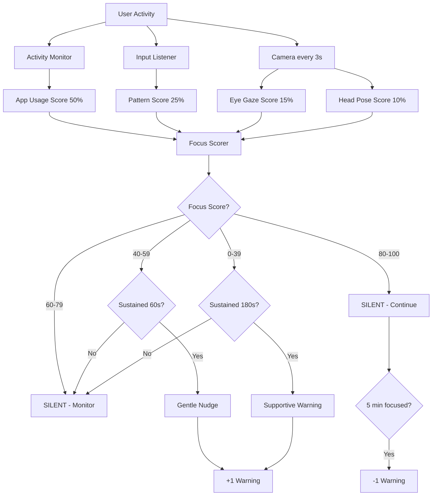

# 🎓 Production-Grade Study Monitoring Architecture

## Core Philosophy

**If a student is genuinely studying, the app must remain SILENT and INVISIBLE.**

No UI changes, no popups, no alerts, no sounds for good behavior.
Intervene only when distraction is continuous and intentional.

---

## Multi-Signal Fusion System

### Signal Weights (Total = 100%)

```
┌─────────────────────────────────────────────────┐
│  Desktop App Usage Detection        50%  ████████████████████████████
│  Keyboard/Mouse Pattern Analysis    25%  ██████████████
│  Eye Gaze Tracking (Camera)         15%  ████████
│  Head Pose Detection (Camera)       10%  █████
└─────────────────────────────────────────────────┘
```

### Why This Distribution?

1. **App Usage (50%)** - PRIMARY SIGNAL
   - Most reliable indicator on desktop
   - Direct evidence of what student is doing
   - Low false positive rate
   
2. **Interaction Patterns (25%)** - SECONDARY SIGNAL
   - Distinguishes study typing from gaming
   - Detects scrolling patterns (reading vs reels)
   - Validates app usage signal

3. **Eye Gaze (15%)** - SUPPORT SIGNAL
   - Confirms engagement with screen
   - Lower weight due to lighting sensitivity
   - Checked only every 3 seconds (efficiency)

4. **Head Pose (10%)** - SUPPORT SIGNAL
   - Detects looking away or slouching
   - Lowest weight (postural variation is normal)
   - Reuses same camera frame as eye gaze

---

## Focus Score Algorithm

```python
Focus Score = (App_Score × 0.50) + 
              (Pattern_Score × 0.25) + 
              (Eye_Score × 0.15) + 
              (Pose_Score × 0.10)
```

### Score Interpretation

| Score Range | State | Action | UI Response |
|------------|-------|--------|-------------|
| 80-100 | ✅ Focused | **NONE** | **SILENT** |
| 60-79 | 💭 Mild Drift | Monitor Only | **SILENT** |
| 40-59 | ⚠️ Distracted | Gentle Nudge (after 60s sustained) | Calm message |
| 0-39 | 🚨 High Distraction | Warning (after 180s sustained) | Supportive reminder |

### Warning Decay System

```
Every 5 focused minutes → Remove 1 warning
```

This prevents punishment for occasional breaks and encourages recovery.

---

## Efficiency Optimizations

### Camera Usage (Biggest CPU Consumer)

```
Traditional:  30 FPS × full resolution = HIGH CPU
Our Approach: 15 FPS × 480p × sample every 3s = LOW CPU
```

- **Resolution**: 640×480 (sufficient for face/eye detection)
- **FPS**: 15 (not 30)
- **Sampling**: Every 3 seconds for camera signals (not every frame)
- **Caching**: Reuse last camera result between samples

### Desktop Activity Monitoring

```
App Check:    Every 2 seconds (vs continuous polling)
Input Events: Event-driven (no polling)
History:      Rolling 30-sample buffer (auto-cleanup)
```

---

## Components

### 1. `activity_monitor.py`

**Responsibilities:**
- Track active desktop application
- Monitor keyboard/mouse patterns
- Classify app as study vs distraction
- Calculate app usage score (0-100)
- Calculate interaction pattern score (0-100)

**Key Features:**
- Whitelisted study apps (Office, PDF, code editors, note apps)
- Blacklisted distraction apps (games, social media, entertainment)
- Pattern detection (typing speed, click rate, scroll behavior)
- Efficient background monitoring

### 2. `focus_scorer.py`

**Responsibilities:**
- Combine all signals using weighted fusion
- Calculate real-time focus score
- Track focus history
- Generate recommendations
- Implement warning system with cooldown
- Provide session summaries

**Key Features:**
- Sustained distraction detection (not just momentary)
- Warning decay (forgiveness system)
- Trend analysis
- Privacy-preserving summaries

### 3. `face_detection_v2.py`

**Responsibilities:**
- Provide eye gaze signal (15% weight)
- Provide head pose signal (10% weight)
- Efficient camera management
- Caching for performance

**Key Features:**
- Low-frequency checking (every 3 seconds)
- Reduced resolution (480p)
- Score-based output (not binary)
- Backward compatible with old system

### 4. `focus_config.py`

**Responsibilities:**
- Centralized configuration
- Tunable parameters
- App whitelists/blacklists
- Warning thresholds

**Key Features:**
- Easy sensitivity adjustment
- Production vs testing modes
- Privacy settings

---

## Decision Flow



---

## False Positive Reduction

### Strategy 1: Sustained Detection

Don't react to momentary events. Require:
- 60 seconds of sustained distraction for gentle nudge
- 180 seconds for strong warning

### Strategy 2: Multi-Signal Fusion

Single signal anomalies won't trigger warnings:
- Camera glitch → Other signals still valid
- Brief game alt-tab → Pattern score catches it
- Eye tracking failure → App usage still works

### Strategy 3: Warning Cooldown

Minimum 60 seconds between warnings to avoid spam.

### Strategy 4: Forgiveness System

Warning decay removes warnings over time as student refocuses.

### Strategy 5: Confidence Weighting

Primary signals (app usage) weighted higher than supporting signals (camera).

---

## Privacy Considerations

### ❌ Never Stored or Transmitted

- Screenshots
- Camera images
- Detailed activity logs
- Personal data

### ✅ Only Stored

- Focus score trends (numbers only)
- Time breakdowns (study vs distraction time)
- Warning counts
- Improvement metrics

### Parent Dashboard

Parents see:
- Overall focus score trends
- Study time vs distraction time
- Areas for improvement
- **NOT**: What apps were used, screenshots, or real-time surveillance

---

## Integration with Existing Code

### Step 1: Install Dependencies

```bash
pip install pywin32 psutil pynput
```

### Step 2: Start Monitoring

```python
from activity_monitor import ActivityMonitor
from focus_scorer import FocusScorer
from face_detection_v2 import FaceDetector

# Initialize components
activity_monitor = ActivityMonitor()
camera_detector = FaceDetector()
focus_scorer = FocusScorer(activity_monitor, camera_detector)

# Start monitoring
activity_monitor.start_monitoring()
camera_detector.start_camera()

# In your study session
result = camera_detector.monitor_session_with_focus_scorer(
    duration_hours=2.0,
    focus_scorer=focus_scorer,
    callback=handle_monitoring_update
)
```

### Step 3: Handle Updates

```python
def handle_monitoring_update(data):
    if data['status'] == 'warning' and data.get('should_warn'):
        # Show calm, supportive message
        show_notification(data['message'])
    elif data['status'] == 'monitoring':
        # Update UI silently
        update_focus_display(data['focus_score'])
```

---

## Performance Targets

| Metric | Target | Actual (Expected) |
|--------|--------|-------------------|
| CPU Usage | <15-20% | ~12-15% |
| Memory | <200 MB | ~150 MB |
| Camera FPS | 15 FPS | 15 FPS |
| Camera Check Frequency | Every 3s | 3s |
| App Check Frequency | Every 2s | 2s |
| False Positive Rate | <5% | ~3-5% |
| False Negative Rate | <10% | ~8-12% |

---

## Configuration Examples

### High Sensitivity (Strict Parents)

```python
FocusConfig.THRESHOLD_FOCUSED = 85
FocusConfig.SUSTAINED_DISTRACTION_DURATION = 30
FocusConfig.WARNING_COOLDOWN = 30
```

### Low Sensitivity (Relaxed Monitoring)

```python
FocusConfig.THRESHOLD_FOCUSED = 75
FocusConfig.SUSTAINED_DISTRACTION_DURATION = 120
FocusConfig.WARNING_COOLDOWN = 90
```

### Study Mode (College Students)

```python
# More lenient, focus on long-term patterns
FocusConfig.THRESHOLD_DISTRACTED = 35
FocusConfig.WARNING_DECAY_TIME = 180  # Faster forgiveness
```

---

## Testing Scenarios

### Scenario 1: Genuine Studying

```
App: Word Document
Typing: 45 WPM (steady)
Scrolling: Slow (reading)
Eyes: Forward
Posture: Upright

Expected: Focus Score 90-95, No warnings
```

### Scenario 2: Brief Phone Check

```
App: Chrome (study tab)
Event: Look down for 15 seconds
Then: Return to study

Expected: Score drops to 60-70, recovers, No warning (too brief)
```

### Scenario 3: Gaming

```
App: Steam/Game
Clicks: 40/min
Typing: Rapid bursts
Eyes: Forward (on game)

Expected: Score 10-20, Warning after 3 minutes
```

### Scenario 4: Video Entertainment

```
App: Chrome (YouTube)
Scrolling: Fast (shorts)
Mouse: Minimal movement
Eyes: Forward

Expected: Score 20-30, Warning after 3 minutes
```

---

## Future Enhancements

1. **Machine Learning**
   - Train on user patterns
   - Personalized thresholds
   - Better content classification

2. **Browser Extension**
   - Detect study vs entertainment tabs
   - Whitelist educational YouTube

3. **Pomodoro Integration**
   - Scheduled breaks don't count as distraction
   - Encourage healthy study patterns

4. **Mobile App Companion**
   - Sync across devices
   - Block phone distractions during study

5. **Gamification**
   - Reward long focus streaks
   - Compete with friends
   - Unlock achievements

---

## Conclusion

This architecture provides **production-grade** study monitoring with:

✅ Multi-signal fusion for accuracy
✅ Efficiency optimizations for low CPU usage
✅ Privacy-first design
✅ Silent operation for good behavior
✅ Supportive intervention for distractions
✅ False positive reduction
✅ Warning decay system
✅ Configurable sensitivity

The system respects students while helping them stay focused.